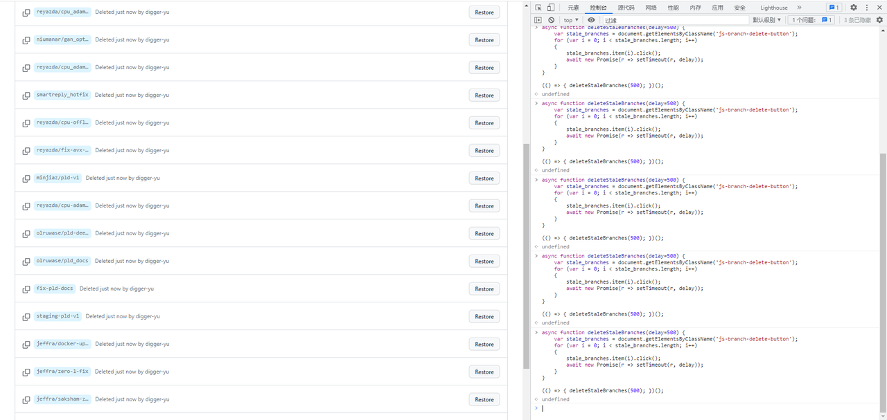

[在线命令速查表](https://digger-yu.github.io/blog/git-config-cheatsheet.html)

[官方手册](https://git-scm.com/docs/git-config)


# personal 
```dotnetcli
优先级 local > global > system
system 先读 → 基础值
global 再读 → 覆盖 system
local 最后读 → 覆盖 global  local是指当前 Git 仓库

git config --list --show-origin
git config --global user.name "digger yu"
git config --global user.email digger-yu@outlook.com
git config --global user.signingkey 93F04D48749C0243
git config --global commit.signoff true
git config --global commit.gpgsign true
git config --global log.showsignature true
git config --global log.abbrevcommit true
git config --global log.date iso
git config --global log.decorate short
git config --global core.autocrlf true
git config --global init.defaultBranch main
git config --global alias.tbmain '!git fetch && git rebase origin/main'
git config --global alias.tbmaster '!git fetch && git rebase origin/master'
git config --global alias.debug '!f() { GIT_CURL_VERBOSE=1 GIT_TRACE=1 git "$@"; }; f'
git config --global alias.lg "log --oneline --graph --decorate --all"
git config --global alias.cloneall 'clone --recurse-submodules'
git config --global alias.vfetch '!f() { GIT_TRACE=1 git fetch "$@"; }; f'
git config --global push.default simple
git config --global pull.rebase true
git config --global fetch.prune true


git config --global --unset <key>

gpg --list-keys
gpg --import public-file.key
gpg --import private-file.key
导出
#gpg -a -o public.key --export 93F04D48749C0243
#gpg -a -o private.key --export-secret-keys 93F04D48749C0243

gpg --edit-key 93F04D48749C0243
trust
5
yes
curl https://github.com/web-flow.gpg | gpg --import
删除
gpg --delete-keys 4AEE18F83AFDEB23
gpg --sign-key B5690EEEBB952194

pip升级及更改源
python -m pip install --upgrade pip
pip config set global.index-url https://pypi.tuna.tsinghua.edu.cn/simple

如果用ssh的方式git clone出现需要输入密码
Enter passphrase for key '/c/Users/digger/.ssh/id_rsa':
可以将密码设置为空,以源密码为123456举例,之后就不需要输入密码了
$ ssh-keygen -p -P 123456 -N '' -f id_rsa
ssh-keygen -p [-P old_passphrase][-N new_passphrase] [-f keyfile]
```

# git diff
```dotnetcli
git diff --color-words
grep -rn "enable" ./* --colour=auto
git commit -S -am "fix typo"
git push origin main:patch1

#查看某次提交修改的所有文件
git show --raw commit_id
git show --stat <commit-hash>
git commit --allow-empty -s -m "test: verify DCO signoff with -s"
git log -1 --pretty=fuller

# 1. 暂存新的修改（README、技术报告等）
git add -A
# 2. 将修改追加到上一个 commit（不产生新 commit）
git commit --amend --no-edit
# 3. 强制推送到远程分支（更新 PR）
git push origin main:feat/windows --force
git push origin feat/windows 
git push <远程仓库名> <本地分支名>:<远程分支名>
各部分含义
origin：远程仓库的别名（通常是默认的远程仓库名称）。
main：你本地的源分支名，表示要推送的内容来自本地的 main分支。
feat/windows：这是你指定的远程分支名（位于冒号右侧）。它表示你想把本地 main分支上的提交，推送到远程仓库 origin上的一个名为 feat/windows的分支。
```

# git clone
```
#clone 用https还是ssh
# 全局配置：所有 github.com 的 https 自动换成 git@
git config --global url."git@github.com:".insteadOf "https://github.com/"

# 仅对子模块生效
git config --global submodule."https://github.com/".url "git@github.com:"

# Git中只克隆一个特定分支
git clone -b main --single-branch <repository URL>
#main 分支名
```
# 统计当前仓库所有被 git 管理的文件的总行数
```
git ls-files | xargs wc -l

# Ubuntu/Debian
sudo apt install cloc
# 自动识别 git 仓库，排除 ignored 文件，按语言分类
cloc --vcs=git .
-------------------------------------------------------------------------------
Language                     files          blank        comment           code
-------------------------------------------------------------------------------
Rust                            14            165            152           2300
YAML                             3             53             48            503
Markdown                         8            126              0            442
Bourne Shell                     2             14             11             45
C                                6              1              5             39
TOML                             1              5              2             20
-------------------------------------------------------------------------------
SUM:                            34            364            218           3349
-------------------------------------------------------------------------------

```

# git 调试模式
```
GIT_CURL_VERBOSE=1 GIT_TRACE=1 git clone https://github.com/xxx.git

git config --global alias.debug '!f() { GIT_CURL_VERBOSE=1 GIT_TRACE=1 git "$@"; }; f'

Example:
da@da:~$ git debug clone https://github.com/digger-yu/dperf
08:50:16.701958 git.c:455               trace: built-in: git clone https://github.com/digger-yu/dperf
Cloning into 'dperf'...
08:50:16.705971 run-command.c:668       trace: run_command: git remote-https origin https://github.com/digger-yu/dperf
08:50:16.707276 git.c:742               trace: exec: git-remote-https origin https://github.com/digger-yu/dperf
08:50:16.707325 run-command.c:668       trace: run_command: git-remote-https origin https://github.com/digger-yu/dperf
08:50:16.712560 http.c:664              == Info: Couldn't find host github.com in the (nil) file; using defaults
08:50:16.926659 http.c:664              == Info:   Trying 20.205.243.166:443...
08:50:17.037725 http.c:664              == Info: Connected to github.com (20.205.243.166) port 443 (#0)
08:50:17.061708 http.c:664              == Info: found 365 certificates in /etc/ssl/certs
08:50:17.061985 http.c:664              == Info: GnuTLS ciphers: NORMAL:-ARCFOUR-128:-CTYPE-ALL:+CTYPE-X509:-VERS-SSL3.0
08:50:17.062034 http.c:664              == Info: ALPN, offering h2
08:50:17.062041 http.c:664              == Info: ALPN, offering http/1.1
08:50:17.177390 http.c:664              == Info: SSL connection using TLS1.3 / ECDHE_RSA_AES_128_GCM_SHA256
08:50:17.179030 http.c:664              == Info:   server certificate verification OK
08:50:17.179045 http.c:664              == Info:   server certificate status verification SKIPPED
08:50:17.179130 http.c:664              == Info:   common name: github.com (matched)
08:50:17.179136 http.c:664              == Info:   server certificate expiration date OK
08:50:17.179139 http.c:664              == Info:   server certificate activation date OK

```
# 创建Personal Access Token
```
vi ~/.gitconfig
[credential]
    helper = store

vi ~/.netrc
machine github.com
    login your-user-name
    password your-personal-access-token
```
```
登录GitHub：在浏览器中打开GitHub，然后登录您的账户。
创建Personal Access Token：
在页面右上角，点击您的头像，然后点击Settings（设置）。
在左侧边栏中，点击Developer settings（开发人员设置）。
在左侧边栏中，找到并单击Personal access tokens（个人访问令牌）。
单击Generate new token（生成新令牌）按钮。
为您的令牌指定一个描述性名称，以便于识别。
选择到期日期。您可以选择默认值或使用日历选择器设置令牌的过期日期。
选择您要授予此令牌的范围或权限。根据您的需求选择适当的选项，例如repo（存储库）
```
# git 清除reflog
```dotnetcli
cd 你的仓库
git reflog expire --all --expire=now
git gc --prune=now --aggressive
```

# git 你的 PR 不是基于上游最新主干开的，需要先追平再合
```
假设你的修改在分支 feature-a，上游远程叫 upstream，目标分支是 main（也可能是 master/dev，按实际来）。
bash
# 1. 切回你的功能分支
git checkout feature-a

# 2. 拉取上游最新代码
git fetch upstream

# 3. 把你的 a 修改"挪"到上游最新头上
git rebase upstream/main
# 如果有冲突，解决后 git add . && git rebase --continue

# 4. 强推更新 PR（PR 会自动跟着变）
git push --force-with-lease origin feature-a
用 --force-with-lease而不是 --force，更安全，能防止你覆盖掉自己或别人意外推到同分支的提交
```

#  设置 Upstream 仓库
```
设置 Upstream 仓库
首先，确保你已经克隆了自己的 Fork 仓库到本地。然后，使用以下命令添加 upstream 仓库：

git remote add upstream https://github.com/原始仓库用户/原始仓库名.git
可以通过以下命令验证 upstream 是否添加成功：

git remote -v
从 Upstream 获取更新

为了同步原始仓库的最新代码，可以使用以下命令从 upstream 拉取更新：

git fetch upstream
此命令会将 upstream 仓库的更新下载到本地，但不会自动合并到当前分支。

合并 Upstream 的代码
将 upstream 的更新合并到当前分支，可以使用以下命令：

git merge upstream/main
这里假设原始仓库的主分支名称为 main，你可以根据实际情况替换为其他分支名称。

推送代码到 Upstream
如果你有权限向原始仓库提交代码，可以使用以下命令将本地修改推送到 upstream 仓库：

git push upstream main
通常情况下，贡献代码的最佳实践是通过创建 Pull Request 来提交更改，而不是直接推送到 upstream。

注意事项
origin 通常指代你 Fork 后的个人远程仓库，而 upstream 指代原始项目的远程仓库。
```
# git 列出所有作者

```dotnetcli
#git 列出所有作者并去重
git log --all --no-show-signature --format='%ae' | grep -v 'noreply.github.com' | sort -u

#git 列出所有作者邮箱并去重#main是分支
git log --pretty=format:"%ae" main | sort -u

列出所有贡献者，并按照贡献数量排序
git shortlog -sn --all

查看所有作者
git log | grep Author: | sort | uniq
```


# 批量删除远程不活跃的分支

```dotnetcli
async function deleteStaleBranches(delay=500) {
    var stale_branches = document.getElementsByClassName('js-branch-delete-button');
    for (var i = 0; i < stale_branches.length; i++)
    {
        stale_branches.item(i).click();
        await new Promise(r => setTimeout(r, delay));
    }
}

(() => { deleteStaleBranches(500); })();
```



# git reset 
```dotnetcli
Soft: 回到选择的版本，但这个版本之后的所有提交(包括工作区未提交的改动)都会保存; 
Mixed: 退回到选择的版本，本地仓库也会变为这一版本的内容，但工作区不会变; 
Hard: 彻底回退到选择的版本，本地仓库也会变为这一版本的内容, 工作区所有改动都会丢失;
```
# 远程分支强制覆盖本地
```dotnetcli
git pull --force  <远程主机名> <远程分支名>:<本地分支名>
git pull --force origin master:master

方法二
$ git fetch --all
$ git reset --hard origin/main
$ git pull origin main

方法二做成别名
git config --global alias.tbmain '!git fetch --all && git reset --hard origin/main && git pull origin main'
git config --global alias.tbmaster '!git fetch --all && git reset --hard origin/master && git pull origin master'
```


# git撤销、还原、放弃本地文件修改
```dotnetcli
1. 未使用git add 缓存代码
git checkout -- filepathname 
放弃所有文件修改 git checkout 
git checkout .
此命令用来放弃掉所有还没有加入到缓存区（就是 git add 命令）的修改：内容修改与整个文件删除
不会删除掉刚新建的文件。因为刚新建的文件还没已有加入到 git 的管理系统中。所以对于git是未知的。自己手动删除就好了。


2. 已使用git add 缓存代码，未使用git commit
git reset HEAD
此命令用来清除 git 对于文件修改的缓存。相当于撤销 git add 命令所在的工作。
使用本命令后，本地的修改并不会消失，而是回到了第一步1. 未使用git add 缓存代码，继续使用git checkout -- filepathname，就可以放弃本地修改

3.已经用 git commit 提交了代码
git reset --hard HEAD^
回退到任意版本git reset --hard commitid，使用git log命令查看git提交历史和commitid
```


# gitignore不生效
```dotnetcli
gitignore中已经标明忽略的文件目录下的文件，git push的时候还会出现在push的目录中，或者用git status查看状态，想要忽略的文件还是显示被追踪状态。
原因是因为在git忽略目录中，新建的文件在git中会有缓存，如果某些文件已经被纳入了版本管理中，就算是在.gitignore中已经声明了忽略路径也是不起作用的，
这时候我们就应该先把本地缓存删除，然后再进行git的提交，这样就不会出现忽略的文件了。
解决方法: git清除本地缓存（改变成未track状态），然后再提交:
git rm -r --cached .
git add .
git commit -m 'update .gitignore'
git push -u origin master
```

# git rebase
```dotnetcli
git log --oneline --decorate
git rebase -i 1654b73
git rebase -i ec34056
git rebase -i cc13e0d
git rebase -i 5549f79
git push origin 5549f79:main --force  从本地分支强制推送到远程分支
git push origin main:main --force  从本地分支强制推送到远程分支
git push REMOTE-NAME LOCAL-BRANCH-NAME:REMOTE-BRANCH-NAME
```
# git 切换远程分支
```dotnetcli
$ git remote set-url origin https://github.com/digger-yu/trex-core.git
$ git remote set-url origin https://github.com/cisco-system-traffic-generator/trex-core.git
$ git remote -v
```
# 添加/移除一个远程库
```dotnetcli
##添加一个远程库
git remote add origin https://github.com/digger-yu/dpef/dperf.git

$ git remote -v  查看远程库的详细信息
origin  https://github.com/digger-yu/dperf.git (fetch)
origin  https://github.com/digger-yu/dperf.git (push)

#移除远程库名字
git remove rm xxx  

#本地分支推送到远程版本库 不跟踪远程分支变化
git push origin 本地库 

#将本地分支推送到远程版本库  跟踪远程分支变化 
git push -u origin master  

## 从本地master分支推送到远程的origin分支
git push -u origin master 
```

# win10上git比较慢
```dotnetcli
git config --global core.preloadindex true
git config --global core.fscache true
git config --global gc.auto 256
```


# This branch is 1 commit ahead of and 2 commits behind 
```
说明 master 上有 2 个新提交还没合入你的分支。需要先 rebase 到最新的 master 上：
# 拉取上游最新代码
git fetch upstream

# 将你的分支变基到最新 master
git rebase upstream/master

# 如果有冲突，解决后 git rebase --continue

# 推送更新
git push origin feat/windows-support:feat/windows-support --force-with-lease
```
# git对某个没有签名的commit 进行签名
```
    git rebase -i [commit's parent hash]
    Change pick to edit for the commit you want to amend.
    Save and exit the editor.
    Run git commit --amend --gpg-sign --no-edit --signoff
    git rebase --continue
---------------------------------------------------------

git rebase --exec 'git commit --amend --no-edit -n -S' -i 25f45cf7cea57ab4aa3b5682cb0772cb21123456
```


# git 设置代理

```
设置全局代理
git config --global http.proxy socks5://127.0.0.1:1080   
git config --global https.proxy socks5://127.0.0.1:7897
取消全局代理
git config --global --unset http.proxy   
git config --global --unset https.proxy

设置对当前项目生效的代理
git config https.proxy https://proxy_host:proxy_port
取消项目代理
git config --unset https.proxy

只对github进行代理
git config --global http.https://github.com.proxy socks5://127.0.0.1:10808
git config --global https.https://github.com.proxy socks5://127.0.0.1:10808
```
# git 加速
```
 git config --global --list
#增加
 git config --global url."https://gitclone.com/".insteadOf https://
#删除
git config --global --unset url."https://gitclone.com/".insteadOf
```

# ssh: connect to host github.com port 22: Connection timed out
```
ssh: connect to host github.com port 22: Connection timed out
fatal: Could not read from remote repository.

Please make sure you have the correct access rights
```
需要通过修改你所生成的rsa所在地址~/.ssh下面的config文件所实现的
需要在你的config部分加入这一些配置，最主要的是第二行。这里为什么要配置成这个呢，
是因为github.com并不会自动的转换为ssh.github.com，我们启动的是后者，而不是前者，这会导致time out的产生。
```
Host github.com
HostName ssh.github.com  # 这是最重要的部分
User git
Port 443
PreferredAuthentications publickey
IdentityFile ~/.ssh/id_rsa

```
# gh config
gh config list
gh config set -h github.com git_protocol ssh

# 清除 Git 提交历史，但保留最新文件
```
# 1. 确保在你的工作分支（比如 main），且工作区是干净的
git status
# 如果有未提交的改动了，先 git add . && git commit -m "save before reset"

# 2. 创建 orphan 分支（无历史的根分支）
git checkout --orphan temp-clean

# 3. 添加所有当前文件（最新状态）到暂存区
git add -A

# 4. 做第一个全新提交
git commit -m "Initial commit (history cleaned)"

# 5. 删掉原来的 main 分支
git branch -D main

# 6. 把 temp-clean 重命名为 main
git branch -m main

# 7. 强制推送覆盖远程（⚠️ 远程历史也会被清掉）
git push -f origin main
```
# 清除 git 所有历史提交记录方案
```dotnetcli
1.创建新分支
语法：git checkout --orphan <new_branch>
2.添加所有文件
git add .
3.commit代码
git commit -m "自定义提交说明"
4.删除原来的主分支(master)
git branch -D master
5.把当前分支重命名为master
git branch -m master
6.最后把代码推送到远程仓库
git push -f origin master
注意： 有些仓库有 master 分支保护，不允许强制 push，需要在远程仓库项目里暂时把项目保护关掉才能推送。
推送前 需要使用 git remote -v 查看关联的远程仓库的信息（主要是远程库的别名）。虽然远程库的别名默认是 origin ,但你可能设置过其他的别名（而非 origin）.
推送前，有的情况需要设置：git branch --set-upstream-to=origin/master master
7.从远程库拉取更新代码(测试)
git pull
8.确定清除历史记录的结果
git log --pretty=oneline
# 列出所有本地分支
git branch
# 列出所有远程分支
git branch -r
# 列出所有本地分支和远程分支
git branch -a
# 查看 tag 信息
# 查看本地标签
git tag
# 查看远程标签
git ls-remote --tags

9. 可登录远程仓库再次确认。
```

# 删除全部历史记录
```dotnetcli
把旧项目提交到git上，但是会有一些历史记录，这些历史记录中可能会有项目密码等敏感信息。
如何删除这些历史记录，形成一个全新的仓库，并且保持代码不变呢？

1.Checkout
   git checkout --orphan latest_branch
2. Add all the files
   git add -A
3. Commit the changes
   git commit -am "commit message"
4. Delete the branch
   git branch -D master
5.Rename the current branch to master
   git branch -m master
6.Finally, force update your repository
   git push -f origin master
```

# 三种合并方式对比：Squash Merge vs Merge  vs Rebase Merge


| 对比维度 | Create a merge commit (默认) | Squash and merge | Rebase and merge |
|---|---|---|---|
| **产出 commit 数量** | N 条原 commit + 1 条 merge = N+1 条 | **1 条**（全部压成一个） | **N 条**（保留原数量） |
| **是否产生 merge commit** | ✅ 是 | ❌ 否 | ❌ 否 |
| **历史形态** | 非线性（有树杈） | 完全线性 | 完全线性 |
| **Commit Hash 变化** | 原 commit hash 不变，仅新增 merge commit | 全部作废，生成全新 commit | 全部作废，每条重新生成 |
| **原作者 (Author)** | ✅ 完全不变 | 取 PR 最后一条 commit 的作者（多人协作时其余人写入 `Co-authored-by`） | ✅ 逐条保留，完全不变 |
| **提交者 (Committer)** | 变为执行合并的人/系统 | 变为执行合并的人/系统 | 变为执行合并的人/系统 |
| **Commit Message** | 保留所有原 message + 新增 merge message | 可在 UI 中重新编辑为一条统一 message | 保留原 PR 中每条 commit 的 message |

---


